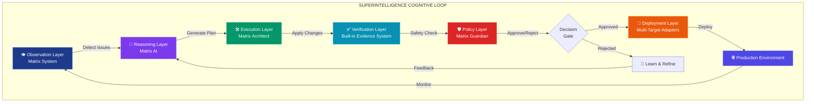
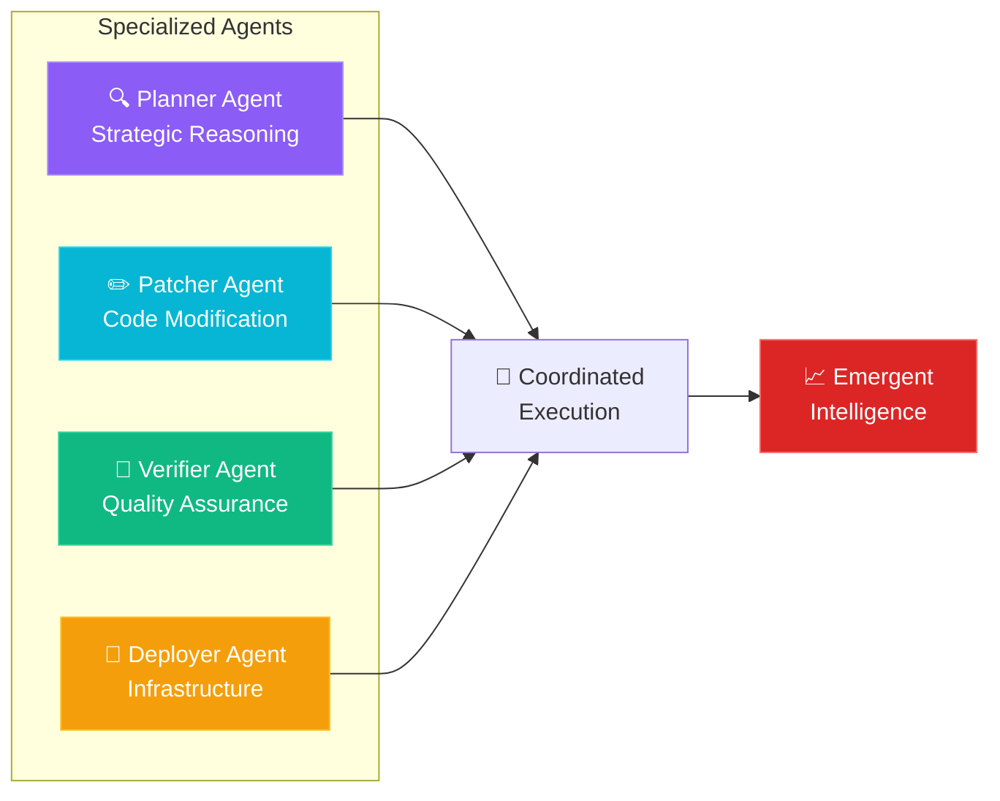
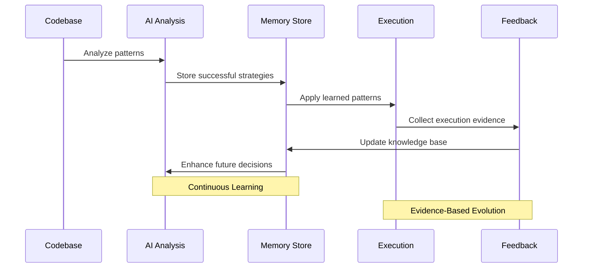
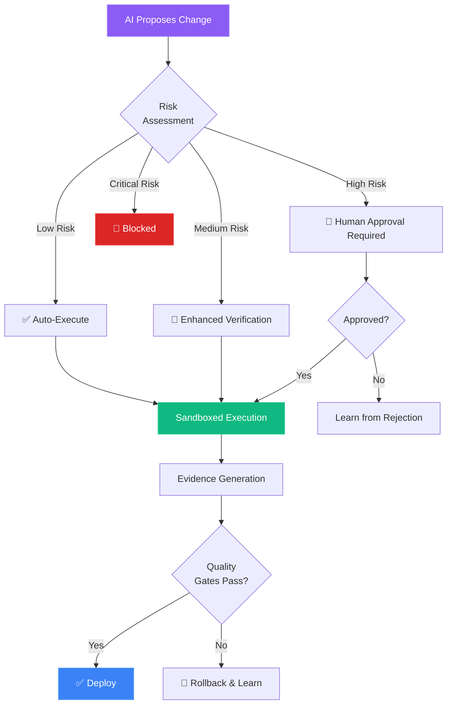
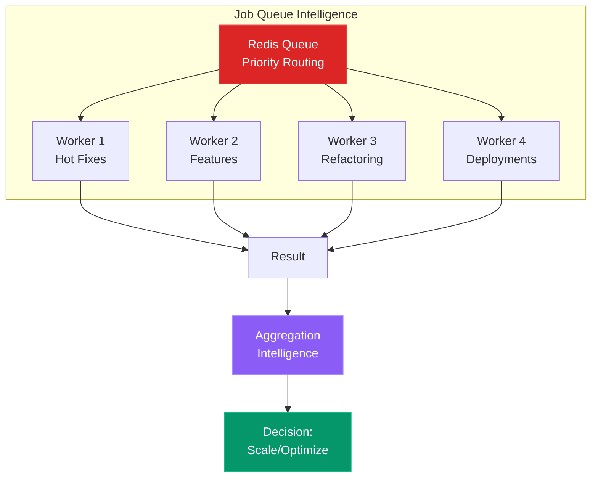
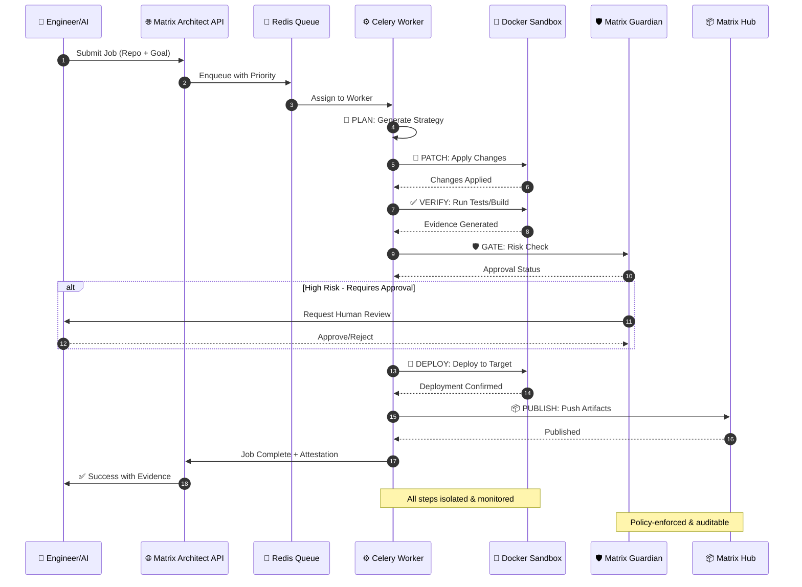
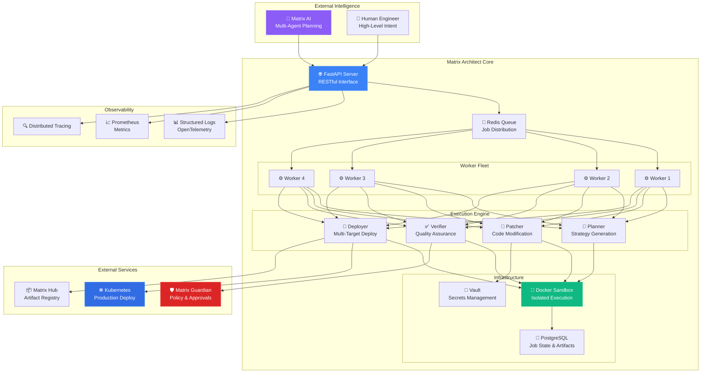
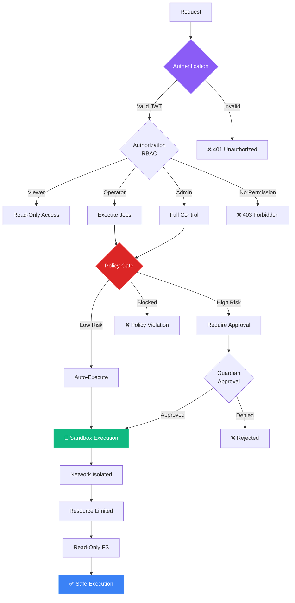
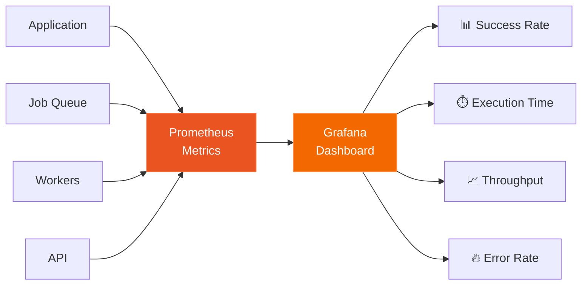
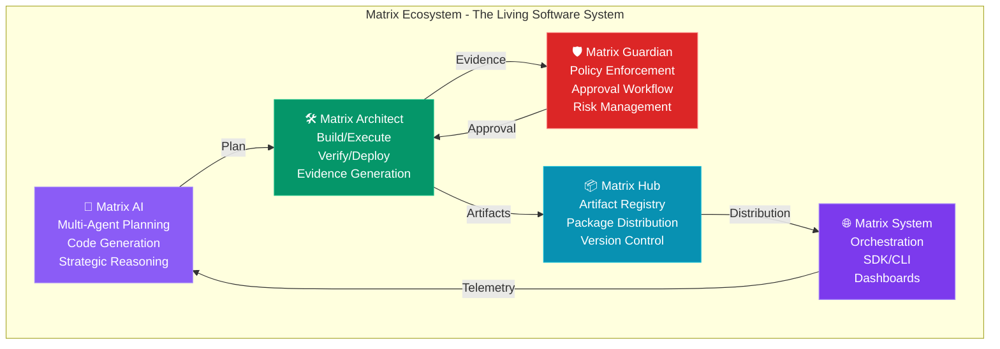

<div align="center">

# 🧠 Matrix Architect

### **The SuperIntelligence Build/Executor Layer**

*Where AI Intent Becomes Reality Through Autonomous Code Evolution*

---

[](LICENSE)
[](https://www.python.org/)
[](https://www.docker.com/)
[](https://github.com/astral-sh/uv)
[](https://fastapi.tiangolo.com/)
[](https://reactjs.org/)
[](https://docs.celeryproject.org/)
[](https://redis.io/)
[](https://www.postgresql.org/)
[](https://kubernetes.io/)

**Production-Grade • Multi-Intelligence • Self-Evolving • Safety-First**

[🚀 Quick Start](#-quick-start) • [🧬 Architecture](#-the-superintelligence-architecture) • [📖 Documentation](#-documentation) • [🎯 Use Cases](#-use-cases) • [🤝 Contributing](#-contributing)

---

</div>

## 🌟 What is Matrix Architect?

Matrix Architect is the **autonomous execution layer** of a multi-intelligence system that transforms AI reasoning into tangible code changes, deployments, and system improvements. It's not just a build tool—it's the **hands of a living software ecosystem**.

### The Vision: Self-Evolving Software Systems

Imagine software that can:
- 🧠 **Understand** its own codebase through AI analysis
- 🎯 **Plan** improvements autonomously using multi-agent reasoning
- 🔧 **Execute** changes safely in isolated sandboxes
- ✅ **Verify** modifications through comprehensive testing
- 🛡️ **Gate** risky operations with policy enforcement
- 🚀 **Deploy** to production with rollback capabilities
- 📦 **Publish** artifacts for ecosystem-wide sharing

**Matrix Architect makes this vision real.**

---

## 🧬 The SuperIntelligence Architecture

### Theoretical Foundation

Matrix Architect operates within a **Multi-Intelligence Cognitive Loop** inspired by human organizational intelligence and distributed AI systems:



### How We Achieve SuperIntelligence

Matrix Architect achieves superintelligence characteristics through **emergent properties** of its multi-layer architecture:

#### 1️⃣ **Collective Intelligence Through Specialization**



Each specialized agent excels at its domain, and their **coordination** creates capabilities greater than the sum of parts.

#### 2️⃣ **Memory & Learning Loop**



**Key Insight**: Every execution generates evidence that improves future operations—creating a system that **gets smarter over time**.

#### 3️⃣ **Safety-First Autonomy**



**Key Insight**: Autonomy without safety is reckless. We achieve **controlled autonomy** through multi-layer safety gates.

#### 4️⃣ **Distributed Execution Intelligence**



**Key Insight**: Parallel execution with intelligent routing creates **adaptive throughput** that scales with demand.

---

## 🎯 How It Works: The Complete Flow



### Pipeline Stages Explained

| Stage | Icon | Purpose | Intelligence Applied |
|-------|------|---------|---------------------|
| **PLAN** | 🧠 | Analyze codebase, generate execution strategy | CrewAI multi-agent planning |
| **PATCH** | 🔧 | Apply minimal, reversible code changes | Diff-based patching with rollback |
| **VERIFY** | ✅ | Run tests, builds, security scans | Evidence-based quality gates |
| **GATE** | 🛡️ | Policy enforcement & approval workflow | Risk scoring + Guardian integration |
| **DEPLOY** | 🚀 | Multi-target deployment (K8s, Docker, Serverless) | Adaptive deployment strategies |
| **PUBLISH** | 📦 | Share artifacts with ecosystem | Version control + SBOM generation |

---

## 🏗️ System Architecture

### High-Level Component View



### Technology Stack

<div align="center">

| Layer | Technologies |
|-------|-------------|
| **🎨 Frontend** | React 18 • Vite • Tailwind CSS • Lucide Icons |
| **🔧 Backend** | Python 3.11 • FastAPI • Pydantic • SQLAlchemy |
| **⚙️ Workers** | Celery • Redis • Kombu |
| **🐳 Sandbox** | Docker SDK • Isolated Containers • Resource Limits |
| **💾 Storage** | PostgreSQL • Redis • Artifact Store |
| **🚀 Deploy** | Kubernetes • Docker Compose • Serverless Adapters |
| **🔐 Security** | JWT • RBAC • Vault Integration • Network Isolation |
| **📊 Observability** | Prometheus • OpenTelemetry • Structured Logging |
| **🛠️ DevOps** | uv • Docker • Make • GitHub Actions |

</div>

---

## 🚀 Quick Start

### Prerequisites

<div align="center">

| Requirement | Version | Installation |
|------------|---------|--------------|
| **uv** | Latest | `curl -LsSf https://astral.sh/uv/install.sh \| sh` |
| **Docker** | 20+ | [Install Docker](https://docs.docker.com/get-docker/) |
| **Node.js** | 18+ | [Install Node](https://nodejs.org/) |
| **Make** | Any | Usually pre-installed on Unix systems |

</div>

### 🎬 Three-Command Setup

```bash
# 1️⃣ Install all dependencies (backend + frontend)
make install

# 2️⃣ Configure environment variables
cp .env.example .env
# Edit .env with your API keys

# 3️⃣ Launch the system
make run
```

**🎉 That's it!** Access the system:

<div align="center">

| Service | URL | Description |
|---------|-----|-------------|
| 🎨 **Frontend** | http://localhost:3000 | Mission Control UI |
| 🌐 **API** | http://localhost:8080 | REST API |
| 📖 **API Docs** | http://localhost:8080/docs | Interactive Swagger UI |

</div>

---

## 📖 Usage Guide

### 1️⃣ Basic Job Execution

```bash
# Start the system
make run

# In another terminal, create a job using the API
curl -X POST http://localhost:8080/api/jobs \
  -H "Content-Type: application/json" \
  -d '{
    "repo": {
      "kind": "github",
      "owner": "your-org",
      "repo": "your-repo"
    },
    "goal": "Upgrade Python dependencies and fix security vulnerabilities",
    "constraints": {
      "require_tests": true,
      "security_scan": true
    }
  }'
```

### 2️⃣ Using the Frontend

1. **Navigate to http://localhost:3000**
2. **Click "New Build Plan"** in the Architect Console
3. **Enter your repository and objective**
4. **Review the generated plan**
5. **Monitor execution in real-time**
6. **Download artifacts and evidence**

### 3️⃣ Docker Compose Deployment

```bash
# Start complete stack (API + Workers + Redis + PostgreSQL + Frontend)
make docker-up

# View logs
make docker-logs

# Stop all services
make docker-down
```

### 4️⃣ Production Deployment

```bash
# Build containers
make build-all-containers

# Publish to registry
export DOCKER_REGISTRY=ghcr.io/your-org
make publish-all-containers

# Deploy to Kubernetes
kubectl apply -f k8s/
```

---

## 💡 Use Cases

### 🔧 Autonomous Code Maintenance

**Scenario**: Keep dependencies up-to-date across hundreds of repositories

```python
# Matrix AI detects outdated dependencies
# Matrix Architect autonomously:
# 1. Plans migration strategy
# 2. Updates dependencies
# 3. Runs full test suite
# 4. Deploys if tests pass
# 5. Creates PR if human review needed
```

### 🛡️ Security Vulnerability Patching

**Scenario**: Critical CVE discovered in production dependency

```python
# Guardian flags high-risk security issue
# Matrix Architect:
# 1. Analyzes impact across codebase
# 2. Generates minimal patch
# 3. Runs security scans
# 4. Requests emergency approval
# 5. Hot-deploys to production
# 6. Monitors for regressions
```

### 📦 Multi-Repository Refactoring

**Scenario**: Migrate 50 microservices to new API version

```python
# Matrix AI generates coordinated plan
# Matrix Architect:
# 1. Executes changes in dependency order
# 2. Runs integration tests per service
# 3. Gradually deploys (canary strategy)
# 4. Generates migration evidence
# 5. Publishes reusable patterns to Hub
```

### 🚀 Continuous Deployment Pipeline

**Scenario**: Developer pushes code, AI handles the rest

```python
# Commit pushed to main branch
# Matrix Architect:
# 1. Runs comprehensive verification
# 2. Checks policy compliance
# 3. Deploys to staging automatically
# 4. Requests approval for production
# 5. Monitors post-deployment metrics
# 6. Auto-rollback if issues detected
```

---

## 📦 Makefile Commands

<details>
<summary><b>📋 View all 50+ commands</b></summary>

### Development
```bash
make run              # 🚀 Run backend + frontend
make serve            # 🎨 Run frontend only
make backend          # 🔧 Run API server
make worker           # ⚙️ Run Celery worker
make frontend         # 🖥️ Run frontend dev server
```

### Docker
```bash
make build-container         # 🐳 Build backend Docker image
make publish-container       # 📤 Build & publish backend
make build-frontend-container   # 🎨 Build frontend image
make publish-all-containers    # 📦 Build & publish all
```

### Docker Compose
```bash
make docker-up        # ▶️ Start all services
make docker-down      # ⏹️ Stop all services
make docker-logs      # 📋 View logs
make docker-restart   # 🔄 Restart services
```

### Testing & Quality
```bash
make test             # ✅ Run tests
make test-coverage    # 📊 Run with coverage
make lint             # 🔍 Run linter
make lint-fix         # 🔧 Auto-fix issues
make format           # 💅 Format code
make quality          # ✨ Run all checks
```

### Database
```bash
make db-migrate       # 📊 Run migrations
make db-revision      # ➕ Create migration
make db-reset         # ⚠️ Reset database
```

### Utilities
```bash
make clean            # 🧹 Clean artifacts
make clean-all        # 💣 Deep clean
make help             # ❓ Show all commands
make info             # ℹ️ System info
make urls             # 🔗 Service URLs
```

</details>

---

## 🎨 Frontend: Mission Control Interface

The Matrix Architect UI is designed as a **futuristic mission control** interface with real-time monitoring and AI interaction.

### Key Features

<table>
<tr>
<td width="50%">

**📊 Real-Time Dashboard**
- Live job metrics
- Worker utilization
- Success rate tracking
- Queue depth monitoring

**🔄 Pipeline Visualization**
- Visual execution flow
- Stage-by-stage progress
- Real-time status updates
- Error highlighting

</td>
<td width="50%">

**💬 AI Chat Interface**
- Natural language queries
- System status updates
- Intelligent responses
- Context-aware suggestions

**📝 Job Management**
- Create jobs with wizards
- Monitor execution
- Download artifacts
- Review evidence

</td>
</tr>
</table>

### Design Principles

- **🌑 Dark Theme**: Optimized for extended use
- **⚡ Real-Time**: Live updates via SSE/WebSocket
- **🎯 Minimal**: Focus on essential information
- **🔮 Futuristic**: Inspired by sci-fi interfaces

---

## 🔐 Security Architecture

### Multi-Layer Security Model



### Security Features

- ✅ **JWT Authentication** - Secure token-based auth
- ✅ **RBAC** - Fine-grained permissions
- ✅ **Sandboxed Execution** - Complete isolation
- ✅ **Network Isolation** - No external access from sandbox
- ✅ **Secrets Management** - Vault integration
- ✅ **Audit Logging** - Complete traceability
- ✅ **Policy Enforcement** - Guardian integration

---

## 📊 Observability & Monitoring

### Structured Logging

```json
{
  "timestamp": "2025-01-01T10:00:00Z",
  "level": "INFO",
  "logger": "matrix_architect.queue.tasks",
  "message": "Job execution started",
  "job_id": "job_992a",
  "worker_id": "worker-01",
  "trace_id": "abc123",
  "user_id": "user_456"
}
```

### Metrics Dashboard



### Key Metrics

| Metric | Description | Alert Threshold |
|--------|-------------|-----------------|
| `jobs_total{status}` | Total jobs by status | - |
| `job_duration_seconds` | Job execution time | p95 > 600s |
| `worker_utilization` | Worker CPU/Memory | > 80% |
| `queue_depth{priority}` | Queue backlog | > 1000 |
| `error_rate` | Failed jobs ratio | > 5% |

---

## 📚 Documentation

<div align="center">

| Document | Description |
|----------|-------------|
| 📘 [README_UPGRADED.md](README_UPGRADED.md) | Comprehensive upgrade guide |
| 🏗️ [ARCHITECTURE.md](ARCHITECTURE.md) | Technical architecture deep-dive |
| 🚀 [QUICKSTART.md](QUICKSTART.md) | Get started in 3 steps |
| ⚙️ [.env.example](.env.example) | Configuration template |

</div>

---

## 🌐 The Matrix Ecosystem

Matrix Architect is one component of a **complete SuperIntelligence system**:



### How They Work Together

1. **Matrix AI** generates intelligent plans
2. **Matrix Architect** executes plans safely
3. **Matrix Guardian** enforces policies
4. **Matrix Hub** distributes artifacts
5. **Matrix System** orchestrates the ecosystem

**Result**: A **self-improving, autonomous software development system** that combines the best of AI and human oversight.

---

## 🤝 Contributing

We welcome contributions from the community!

### How to Contribute

1. **Fork** the repository
2. **Create** a feature branch (`git checkout -b feature/amazing-feature`)
3. **Make** your changes
4. **Run** quality checks (`make quality`)
5. **Commit** your changes (`git commit -m 'Add amazing feature'`)
6. **Push** to the branch (`git push origin feature/amazing-feature`)
7. **Open** a Pull Request

### Development Setup

```bash
# Install dependencies
make install

# Run tests
make test

# Run linter
make lint

# Format code
make format
```

---

## 📝 License

This project is licensed under the **Apache License 2.0** - see the [LICENSE](LICENSE) file for details.

**Apache 2.0** allows you to:
- ✅ Use commercially
- ✅ Modify the code
- ✅ Distribute
- ✅ Patent use
- ✅ Private use

**With the conditions**:
- 📄 Include license and copyright notice
- 📋 State changes made
- 🔒 Include NOTICE file if provided

---

## 🎯 Roadmap

### v2.1 - Enhanced Intelligence (Q1 2025)

- [ ] 🔌 GraphQL API for flexible queries
- [ ] 🔄 WebSocket support for real-time updates
- [ ] ⏰ Advanced scheduling with cron support
- [ ] 🏢 Multi-tenancy support
- [ ] 🧠 Enhanced AI planning with GPT-4+

### v2.2 - Advanced Autonomy (Q2 2025)

- [ ] 🤖 Machine learning for plan optimization
- [ ] 🔧 Self-healing capabilities
- [ ] 🎯 Canary deployments
- [ ] 🧪 Integration testing framework
- [ ] 📊 Advanced analytics dashboard

### v3.0 - Full Autonomy (Q3 2025)

- [ ] 🌍 Multi-region support
- [ ] 🔄 Auto-scaling based on AI predictions
- [ ] 🛡️ Advanced policy engine with ML
- [ ] 🌐 Federation with other Matrix instances
- [ ] 🧬 Self-evolving architecture

---

## 💬 Community & Support

<div align="center">

| Channel | Link | Purpose |
|---------|------|---------|
| 📧 **Email** | support@matrix.ai | General support |
| 💬 **Discord** | [Join Server](https://discord.gg/matrix-ai) | Community chat |
| 📚 **Documentation** | [docs.matrix.ai](https://docs.matrix.ai/architect) | Full docs |
| 🐛 **Issues** | [GitHub Issues](https://github.com/agent-matrix/matrix-architect/issues) | Bug reports |
| 💡 **Discussions** | [GitHub Discussions](https://github.com/agent-matrix/matrix-architect/discussions) | Ideas & questions |

</div>

---

## ⭐ Star History

<div align="center">

If you find Matrix Architect useful, please consider giving it a ⭐!

**Built with ❤️ by the Matrix Team**

*Powered by Python 3.11 • uv • FastAPI • React • Docker • Kubernetes*

---

### 🚀 Ready to Build the Future?

```bash
make install
make run
```

**Join us in creating the first true SuperIntelligence development system.**

</div>
